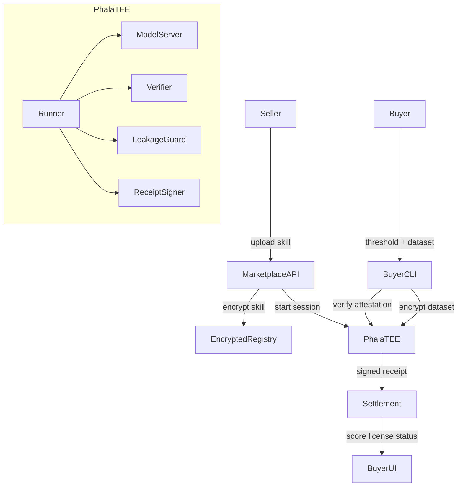

# SkillVault TEE — Technical Architecture

## Overview

SkillVault TEE uses a marketplace-hosted Phala TEE as a neutral execution environment. The seller's skill, buyer's dataset, open-weight model, verifier, and leakage guard all run inside the same attested TEE.

Default inference mode: **Phala TEE + local open-weight model** (no external LLM calls).

**Mode 2 (agent stack):** Phala TEE orchestrates zip-based agent harness + optional sandbox-manager; model calls route to [NEAR AI private inference](inference/near-private.md) (GPU TEE). Receipts bind SkillVault and NEAR attestations.

## System diagram



## Components

| Component | Location | Responsibility |
| --------- | -------- | -------------- |
| Marketplace UI | `apps/web/` | Seller upload, buyer browse, threshold, scorecard, proof display |
| Marketplace API | `apps/api/` | Auth, skill storage, TEE sessions, jobs, settlement, licenses |
| Buyer CLI | `packages/cli/` | Local dataset read, attestation verify, encrypt to TEE, display report |
| TEE runner | `services/tee-runner/` | FastAPI server: decrypt inputs, orchestrate eval, sign receipt |
| Model server | `services/model-server/` | OpenAI-compatible local LLM at `localhost:8000` inside TEE |
| Verifier | Inside tee-runner | Score outputs against ground truth |
| Leakage guard | Inside tee-runner | Block skill/dataset leakage in outputs |
| Settlement | Inside API | Simulated balance, threshold settlement, license records |

## Planned monorepo layout

```text
apps/web/                    # Next.js marketplace UI
apps/api/                    # Marketplace orchestration API
packages/cli/                # TypeScript buyer CLI
services/tee-runner/         # Python FastAPI + verifier + leakage guard
services/model-server/       # vLLM / llama.cpp / Ollama wrapper
skills/discreet-meeting-notes/   # MVP skill package
```

## Data flows

### Skill upload

1. Seller uploads skill package via UI.
2. API validates format, metadata, and safety checks.
3. API computes `skill_hash = sha256(skill_package)`.
4. Skill encrypted and stored in object storage.
5. Registry stores metadata, hash, price, evaluation type.

### Evaluation session

1. Buyer selects skill and sets threshold (e.g. 0.85).
2. API checks buyer eligibility and simulated balance.
3. API provisions Phala TEE runner session.
4. TEE generates ephemeral key pair and attestation report.
5. Buyer CLI verifies attestation (runner hash, verifier hash, model hash).
6. Buyer CLI encrypts local dataset to TEE ephemeral public key.
7. API encrypts seller skill to same TEE session public key.
8. TEE decrypts both packages internally.

### Evaluation execution

1. **Baseline run**: model inference without seller skill.
2. **With-skill run**: model inference with seller skill loaded.
3. **Verifier**: scores both runs against buyer ground truth.
4. **Leakage guard**: checks output for skill/dataset leakage.
5. **Receipt signer**: produces signed TEE receipt with scores and pass/fail.

### Settlement

```text
if skill_score >= threshold:
  deduct buyer balance
  credit seller balance
  issue license
else:
  no charge
  no license
```

## Key interfaces

### Attestation endpoint

TEE runner exposes attestation with:

- TEE attestation quote
- Runner image hash
- Verifier hash
- Model hash
- Ephemeral public key (for buyer dataset encryption)

See [tee-runner/attestation.md](tee-runner/attestation.md).

### Encrypted input bundle

Buyer dataset and seller skill arrive as encrypted blobs keyed to the TEE session ephemeral public key. Plaintext exists only inside the TEE after decryption.

See [tee-runner/encrypted-inputs.md](tee-runner/encrypted-inputs.md) and [buyer-cli/encryption-flow.md](buyer-cli/encryption-flow.md).

### Evaluation job API

Marketplace API creates evaluation jobs, tracks status, and retrieves signed receipts.

See [marketplace-api/evaluation-jobs.md](marketplace-api/evaluation-jobs.md).

### TEE receipt schema

Signed record proving:

- Skill ID and hash evaluated
- Runner, verifier, model hashes
- Baseline score, skill score, uplift
- Threshold and pass/fail
- Attestation reference
- Timestamp

Does not include raw skill or buyer data.

See [tee-runner/receipt-signing.md](tee-runner/receipt-signing.md).

### Model server API

OpenAI-compatible endpoint inside TEE:

```text
POST http://localhost:8000/v1/chat/completions
```

Used for baseline and with-skill inference. No external requests.

See [model-server/openai-compatible-api.md](model-server/openai-compatible-api.md).

### Buyer dataset format

```text
buyer_eval_dataset/
  transcripts/
    meeting_001.txt
  ground_truth/
    meeting_001.json
  eval_config.json
```

See [buyer-cli/dataset-format.md](buyer-cli/dataset-format.md).

### Skill package format

```text
skill/
  SKILL.md
  scripts/
  examples/
  metadata.json
```

See [skill-package/README.md](skill-package/README.md).

## Scoring model

| Metric | Definition |
| ------ | ---------- |
| Baseline score | Score without seller skill |
| Skill score | Score with seller skill |
| Uplift | `skill_score - baseline_score` |
| Threshold | Buyer-defined minimum for purchase (e.g. 0.85) |

Redaction scoring checks: must-include items, must-not-leak terms, attribution removal, format validity, utility preservation.

See [evaluation/redaction-verifier.md](evaluation/redaction-verifier.md).

## TEE runner API restrictions

The TEE runner must **not** expose:

- Raw skill file endpoint
- Raw dataset endpoint
- Raw prompt logs
- Debug shell
- Verifier internals
- Model prompt traces

## Inference modes

| Mode | MVP | Description |
| ---- | --- | ----------- |
| Mode 1: Phala + local model | Yes (default) | All inference inside TEE |
| Mode 2: NEAR AI private inference | No | Optional future; adds trust boundary |
| Mode 3: External LLM API | No | Disabled; leaks buyer data |

## Layer documentation

| Layer | Docs |
| ----- | ---- |
| TEE runner | [tee-runner/](tee-runner/) |
| Model server | [model-server/](model-server/) |
| Evaluation | [evaluation/](evaluation/) |
| Skill package | [skill-package/](skill-package/) |
| Buyer CLI | [buyer-cli/](buyer-cli/) |
| Marketplace API | [marketplace-api/](marketplace-api/) |
| Marketplace UI | [marketplace-ui/](marketplace-ui/) |
| Settlement | [settlement/](settlement/) |
| Security | [security/](security/) |

## Related docs

- [PROJECT.md](PROJECT.md) — product scope
- [IMPLEMENTATION.md](IMPLEMENTATION.md) — build phases
