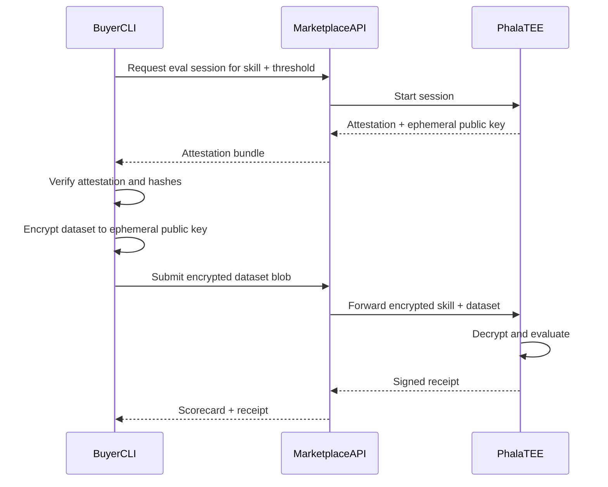

# Encryption Flow

Steps the buyer CLI performs before sending data to the marketplace.

## Flow

## Verification checklist

Before encrypting:

- [ ] Phala attestation quote valid
- [ ] `runner_hash` matches expected published hash
- [ ] `verifier_hash` matches expected published hash
- [ ] `model_hash` matches listing's declared model
- [ ] Session not expired

## Encryption

- Encrypt entire dataset directory as a single archive or structured bundle
- Use TEE session `ephemeral_public_key` (hybrid encryption: AES + RSA/ECDH as appropriate)
- Include dataset hash in submission for integrity check

## On verification failure

CLI must abort and display reason. Do not encrypt or send dataset.

## Related

- [../tee-runner/attestation.md](../tee-runner/attestation.md)
- [../tee-runner/encrypted-inputs.md](../tee-runner/encrypted-inputs.md)
- [dataset-format.md](dataset-format.md)
